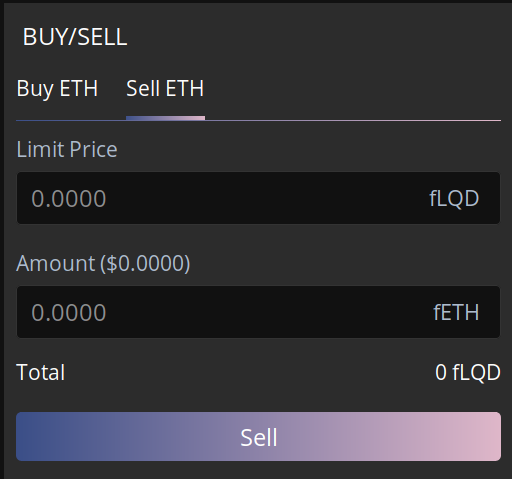

# Documentation - TEX


The following document shall present how TEX internal components do interact between each other.

[TOC]


## Introduction


There are two components behind TEX:

+ **TEX front-end**: Build using React, it is a front-end component. In term of wallets, it should provide a web3 object to the in-browser library. This object can include hardware wallets (ledger), bridges (wallet connect), extensions (metamask) or in-browser wallets (web accounts). Repo is github.com/liquidity-network/tex-frontend.
+ **Frame**: This is a web page that is meant to be integrated within the TEX. It performs all nocust related operations and associated wallet management. Repo is github.com/liquidity-network/in-browser-library


Two Nocust client instance are associated respectively to the for-mentionned components:

+ **In browser library**: This is a proxy implementing `NocustManager` interface.
+ **Nocust Manager**: This is a class extending NocustManager provided by `nocust-client`.


### Motivations

#### Sub accounts

Nocust protocol requires an account balance to be frozen in order to perform a swap. This isn't practical for an exchange aiming at replacing centralised exchange and a high throughput.

#### Posting for future rounds

This does hold because the hub has no incentive to post an invalid state onchain, otherwise its operation may be halted. Therefore an account can safely sign swaps for future rounds.

#### Frame

Nocust management is done under a separate domain to leverage the storage of private keys. Using a separate domain allows to benefit from separate storage areas. In addition, the same nocust accounts can be used across different versions of the TEX (rinkeby, mainnet, limbo) since the frame doesn't rely on a given provider.

#### Worker

Control requests going out of the Frame. It should only allow requests to *.liquidity.network and *.infura.io and be a standalone application. At the moment, worker is used to manage private keys and account creation.

#### Nocust manager (inheritance and proxy)

Provides the same interface as `nocust-client` but supports multiple accounts. In addition, the proxy implements an adapter pattern to the TEX, which prevents breaking changes in `nocust-client` interface to impact TEX front-end.


### Glossary

**Hub**: Nocust instance, formed of a smart contract and a web accessible endpoint (one for HTTP and another one for WebSocket)

**Token**: ERC20 or Native asset registered on ethereum

**Wallet**: Set of public/private key

**Account**: Wallet registered on a token

**External wallet**: Wallet owned by the user. Can be a ledger, wallet connect, Metamask or any other wallet TEX integrates.

**Main wallet**: Wallet holding funds in the frame. This is part of sub wallets

**Sub wallet**: Wallet dedicated for a swap


## TEX front-end


Current interface deployed under tex.liquidity.network.

It is registered on rinkeby with 3 tokens: ETH (native), LQD (ERC20) and DAI (ERC20).

### Components

The front end is build using React Framework. It is architectured around components. These are located under `src/components`.

The state is managed using redux and located under `src/state`.

#### Balance


Made for deposit and withdraw. It fetches Ethereum balance every 3 seconds and nocust balance.

Clicking deposit will asks for an amount and to confirm the onchain transaction, providing fee amount to be paid.

Once a transaction is performed, it is added to `Transactions` component.


#### Header


+ **Tokens**

View token pairs and select the desired one. Webpage is refreshed when clicking and it points users to `/trade/f<token1>-f<token2>`

Current token pair being retrieved from `window.location`, altering the address is sufficient to change the token pair being traded by users.

Addresses of tokens are defined in `src/constant/staticData.ts`.

+ **Languages**

Allow users to switch language. This uses `i18n` standard. Language files are located under `/src/assets/locales`

+ **Wallet**

External wallet which is currently being used for trading. Clicking on the address allows users to connect a new wallet and check if the hub is malicious or not.

> At the time of writing, only in-browser wallets are supported and in case the hub is malicious, no button is provided for users to withdraw.

#### Order



Publish swap order on the exchange. `Buy` will buy the primary token in the pair. `Sell` will sell it against the secondary token. In case of `fETH-fLQD`, the primary token is `ETH` and the secondary is `LQD`.

The posted order contains `Amount` and `Total = Amount*Price`. `Price` can then be retrieved with `Total/Amount`.

When posted, the order triggers an update of orderbook and transaction components.

Along with the amount in crypto, the component also displays a price in USD ($). This price is retrieved using Balanc3 API. First the price of ETH in USD, and then the price of tokens in ETH. This is updated every minute.

#### OrderBook


What is price, what is buy, what is sell

How are ordered filled

How is it updated realtime


#### PriceChart


Current version display a static image.

PriceChart component is commented out. It integrates `TradingView` charts. No adapter with the hub has been implemented because it requires an analytic endpoints to expose previous swaps.


#### TradeHistory


Trade history holds data on swaps performed on the current token pair. It is updated via web socket events sent on server side (`/sync/swaps`).

> Past orders are not displayed because no endpoint are provided by liquidity nocust hub to retrieve them.
>
> It is important to note price is always 1. In fact, swaps data are retrieved from `/tranfer/<id>` which doesn't feature `amount_swapped`. In order to retrieve the price, one would have to get the sender wallet, retrieve all its transfers and then get the one with id `<id>`.


#### Transaction


Transaction component is meant to display all transactions performed by the user. This includes `Deposit`, `Withdrawal`, `Buy` and `Sell`. Once added, transaction state is updated while the website is open. When closed, transactions are saved to `localStorage` and retrieved on next visit.

`Deposit` and `Withdrawal` starts `Pending` and are `Confirmed` once nocust server has included them.

`Buy` and `Sell` are `Pending` while they aren't matched. Once matched they are `Confirmed`.

If transaction doesn't go through, its state is set to `Error`.

> There is also `Checkpointed` and `Canceled` states. `Checkpointed` is meant to differentiate between a confirmed transaction and one that is included in a confirmed nocust commit. `Cancelled` notify the user that its transaction has been properly cancelled.

When user delete a transaction, their data is removed from localStorage and can no longer be retrieved.


### Management

#### Build

Project is build using webpack. You can type the following command to run it locally. It starts tex-frontend and uses `liquidity-network.github.io/in-browser-library/frame.html` for frame. Address of the frame can be modified in `/public/index.html`

```bash
npm install
NODE_ENV=production npm run start
```

A local web server is accessible on port `:3000` to see the website live. Webpack compilation is triggered on file modification.


#### Deploy

Live version is identical, but built and deployed using

```bash
npm run deploy
```

This deploys the website on `gh-pages`  branch of the repo, which is linked to `https://tex.liquidity.network`.


#### Github pages routing

It has to be noted that github pages doesn't supported dynamic urls. Therefore, when accessing a webpage such as `/trade/f<token1>-f<token2>`, Github Pages redirect the user to `404.html`. A custom instance of  `404.html` is included in the repo and rewrites the url such `react-router` can interpret is seamlessly. If the url has to be modified, please modify the template.


### Constants

Tokens: `src/constants/staticData.ts`

Hub Address: `tokens.ETH`

Network: `rinkeby`

Frame location: `document.getElementById('superFrameStory')`


## In browser library

In browser library provides a way to interact with the Frame through a Nocust Manager interface. It provides a `NocustManager` proxy.

Provided a frame, in-browser-library performs nocust operation within a controlled environment.

### Integration

In-browser-library is part of `in-browser-library` repository. Part responsible for the proxy is located under `src/in-browser`.

Frame is not part of the in browser library because it simply acts as a proxy. There could be a dynamic integration for it to be reused in other website

### Folder structure

```
├─── docs: Files deployed on github pages
├─── src
│    ├─── constants: Crypto related constants (nocust and ethereum)
│    ├─── frame
│    │    ├─── actions: Actions the frame can handle
│    │    ├─── index: Event handling
│    │    └─── toWorker: Communication with web worker
│    ├─── in-browser
│    │    ├─── action: Action parent environment has to answer
│    │    └─── index: Interaction with frame example. Used for testing
│    ├─── lib
│    │    ├─── nocust-client
│    │    │    ├─── frame: Subclass of NocustManager, performing operations using multiple accounts
│    │    │    └─── inBrowser: Nocust proxy. Used by parent environment to communicate with frame nocust client
│    │    └─── web3
│    │         ├─── index: Web3 handling sub accounts
│    │         └─── ParentProvider: Web3 provider proxying calls to parent environement
│    ├─── utils: Logging interface and event handling wrappers
│    └─── worker
│         ├─── accounts: Create and retrieve sub walllets
│         ├─── actions: Action worker can handle
│         ├─── authentication: Authenticate external wallet
│         ├─── cache: Map implementation using cache storage
│         └─── index: Event handling
└─── template: Html template for html-webpack-plugin
```


## Frame

The webpage available at liquidity-network.github.io/dist/frame.html. It listens on incoming messages to perform Nocust related operations. When a website, such as TEX, wants to provide `nocust-client` to its users, it simply needs to uses the aforementioned  `in-browser-library` and includes the webpage in a frame object. Hence its name, Frame.

### Communication

Because all entities the frame has to deal with are in a separate Javascript thread (window or worker), most communication is done through `postMessage` (https://developer.mozilla.org/en-US/docs/Web/API/Worker/postMessage).

The parent environment calls it and the child has a listener on new messages. Along with `data`, the parent passes a `MessageChannel` instance. The child uses it to get back to the parent with a response. This creates a unidirectional communication channel between the two entities.

Two methods are defined in `/src/utils/index` to create a promisified version of this channel.

+ `createParentSendMessage` returns an asynchronous method resolved on child answer.

+ `createChildrenSendMessage` returns a callback method to send a response to the parent.

Please find the configuration of the different channels between TEX components.


You can find more about the internal of web3 providers (parent and nocust) in their associated section.


### Build

Frame doesn't require any user interface. It is exposing a javascript library and handling events triggered by a parent environment. In fact, if it wasn't for private key management, the library could be included directly.

Library is embedded into an HTML webpage using `html-webpack-plugin`.

`yarn run build-production` compiles the library and creates `frame.html` under `/dist`. Pushing the modifications to github triggers a deployment on Github pages.

If you are developing locally, you should create a web server to serve the frame. Just use `python3 -m http.server` at the root of the project do the trick. `/dist` includes the production build and `/docs` a development build.

There are two ways to use the library:

+ If you are only dealing with the frame, a sample parent environment is provided under `/docs/index.html`
+ If you are willing to integrate the frame in your environment (TEX for instance), you can access the frame at `http://localhost:<port>/dist/frame.html`


### Storage

+ cache and cachemap -> why is it dangerous and why acceptable

+ localstorage


### Web3 Providers

Frame should follow web3 configuration of the parent environment. In addition, some signatures should be provided both by the external wallet and sub wallets, which are in different environment. To use then easily, two web3 providers have been defined.

#### Parent Provider

Some operations are meant to be performed by the parent environement. It can be for authentication or some on chain transactions.

Parent provider provides a web3 provider that is proxying transactions from the frame to the parent window. By this process, signature that have to be performed by the external wallet, such as authentication, are handled by the parent environment while remaining transparent to the inner frame.

Custom methods are:
+ `getAccounts`,
+ `approveTransaction`,
+ `signTransaction`,
+ `approveMessage`,
+ `signMessage`,
+ `sendTransaction`,

Other methods are inherited from `WebSocketProvider`


#### Nocust Provider

Signature and wallet creations are handled by a worker. Being in a different environement, it also requires a wrapper around web3.

This wrapper is handling authentication and signatures with the multiple sub wallets. An unauthorised user won't see the difference with a regular web3 while an authenticated one will have access to the sub wallets it owns.

Custom methods are:

- `getAccounts`,
- `approveTransaction`,
- `signTransaction`,
- `approveMessage`,
- `signMessage`,
- `sendTransaction`,

Other methods are inherited from `WebSocketProvider`


## Nocust Manager

Nocust manager extends `nocust-client:NocustManager` class. As a children, it provides the same interface, not requiring more knowledge from the developer side.

This section shall describe the operation that have been redefined. All other methods have been inherited from `nocust-client`.


### Posting a swap

A new account is generated for each swap. Therefore, when the external account wants to perform a swap: 

+ A set of public/private key is generated
+ This new wallet registers two accounts on the hub, one for every token involved in the trade
+ Funds are transfered via nocust hub from Main account to sub account
+ Sub account posts a swap for a finite number of rounds (let say 1000). Its balance is frozen during that time

#### Prerequisite

+ Have an `wallet` registered with token `A` and `B`
+ Nocust balance of `100 A`
+ `user` is authenticated

#### Sequence
```sequence
Title: Posting a swap from 100 A to 3 B

participant TEX
participant Frame
participant Hub

TEX -> Frame: Swap 100 A with 3 B
Frame -> Frame: Create Sub wallet
Frame -> Hub: Create Sub account for A
Frame -> Hub: Create Sub account for B
Frame -> Hub: Transfer 100 A from Main to Sub
Frame -> Hub: Swap 100 A with 3 B on Sub
Frame --> TEX: Swap posted
Hub --> Hub: Swap is matched perfectly
Hub -> Frame: Swap matched
Note over Frame,Hub: Wait for a round
TEX -> Frame: Nocust balance
Frame -> Hub: Synchronise sub wallets
Frame -> Hub: Nocust balance for Main
Hub -> Frame: Nocust balance for Main
Frame -> TEX: Nocust balance
```

### Authentication

While nocust manager has full control over sub wallets private keys, it shouldn't provide access to unauthorised entities. For this reason, each external wallet has a distinct set of sub wallets.

In order to use them, web3 instance provide by the parent window (TEX) should be able to sign message with the wallet it wants to authenticate. This signature is performed using `ParentProvider` web3 provider.

When `signMessage` is called, it sends a message to the parent window which handles the signature and pass it over to the frame once completed. Signature is checked within the frame and access to corresponding sub wallets are granted.

Once authenticated, an external wallet can perform nocust related operation for a certain amount of time before being asked to sign in again.

#### Prerequisite

+ Tex has access to an `external wallet` being able to sign message. It can be a hardware wallet, Wallet connect integration, Metamask or a wallet in Browser

#### Sequence
```sequence
Title: Authentication

participant TEX
participant Frame
participant Worker

TEX -> Frame: Register External wallet
Frame -> Worker: Create Main wallet for External
Worker -> Worker: Generate Main wallet
Worker -> Worker: Append Main wallet to External' Sub wallets
Worker -> Frame: Main wallet created

Note over Frame, Worker: When Frame needs to sign messages
Frame -> Worker: Sign message with Sub for External
Worker -> Worker: External is authenticated
Worker -> Frame: Message signed

Note over Frame, Worker: After Main is registered with Nocust Hub
Frame -> TEX: External wallet registered
```

### Deposit ETH

Deposit of ETH has to be performed by Main account in order for the library to be able to perform all operation without requiring multiple signatures from the external wallet.

The External wallet performs a transaction on the parent chain. This transaction includes the amount to be deposited plus the fees the Main account will have to pay.

Once this transaction is performed, Main account can deposit without requiring any external interactions.

#### Prerequisite

+ External account has `(1 + ~0.001) ETH`
+ Main wallet has an `ETH` account

#### Sequence
```sequence
Title: Deposit of 1 ETH

participant External
participant Main
participant Hub

External -> Main: On chain Transfer of 1 ETH
Main -> Hub: Register off chain
Hub -> Main: Registered
Main -> Hub: On chain deposit of 1 ETH

Note over Main, Hub: Wait for deposit confirmation
Hub -> Main: Deposit confirmed
```

### Deposit ERC20

Depositing ERC20 is slightly more challenging. In fact, it is not a deposit but an approval on the ERC20 contract that has to be made.

The pattern is the following:

+ External account approves Main account to spend its token. This requires a transaction on the parent chain
+ External account performs a parent chain transaction in native token so Main account can pay for transaction fees.
+ Main account performs a normal nocust registration with the hub.

#### Prerequisite

+ External account has `(~0.005) ETH`
+ External Account has `1 DAI`
+ Main wallet has an `DAI` account

#### Sequence
```sequence
Title: Deposit of 1 DAI

participant External
participant Main
participant Hub


External -> Main: Approve 2**256-1 DAI
Main -> Hub: Register off chain
Hub -> Main: Registered
Main -> Hub: Approve 2**256-1 DAI
External -> Main: Transfer 1 DAI from External
Main -> Hub: Transfer 1 DAI from Main

Note over Main, Hub: Wait for deposit confirmation
Hub -> Main: Deposit confirmed
```


### Synchronisation

Has to be performed when getting back to the tex after it has been offline

Also, because not all events are listed on nocust server yet (or abstracted by nocust client), this has to be performed from time to time.

It has to be performed for every token Main wallet has an account for.


#### Prerequisite

+ Main account
+ Operation is performed for every subaccounts

#### Flow
```flow
st=>start: Start
itsub=>condition: subaccounts.next()
sub=>operation: Get subAccount
bal=>condition: subAccount.balance() > 0
tr=>operation: Nocust Transfer from subAccount to mainAccount
e=>end: End

st->itsub
itsub(yes)->bal
itsub(no)->e
bal(yes, right)->tr
tr(right)->itsub
bal(no,bottom)->itsub
```


### Withdrawal

The chosen solution is implemented in the same way the synchronisation happen. In this method, the user needs to be online twice but only has to sign a message with its external wallet once. It also doesn't require the external wallet to have account with the hub and therefore an insurance collateral and balance to check at regular intervals.

#### Prerequiste

+ Main wallet holds `1 ETH` on the Hub
+ Main wallet can pay withdrawal fees on the parent chain and a transfer to TEX

#### Sequence
```sequence
Title: Withdrawal

participant TEX
participant Frame
participant Hub

TEX -> Frame: Withdraw 1 ETH
Frame -> Hub: On chain withdrawal request of 1 ETH

Note over Frame, Hub: Wait for withdrawal confirmation
Hub -> Frame: Withdrawal confirmed
Frame -> TEX: On chain Transfer of 1 ETH
```


### Nocust balance

Returns balance of the main account. In fact, balance  currently involved in swap cannot be used and if available, it is brought back to the main account at synchronisation time.


### Creation of sub wallets

To create sub wallets, an external wallet needs to be authenticated.

1. A seed is generated randomly at load time
2. When a sub wallet has to be created, the path is derived from the current number of sub wallets
3. This new sub wallet is associated with the external wallet.


## What comes next

### Testnet

+ trade history once endpoint accessible on the server
+ price chart -> once trade history is accessible, create an adapter to tradeview format
+ tests on in-browser-library
+ tests on tex front-end
+ withdrawals


### Improvements

- full nocust manager proxy. for now some methods which don't require a wallet are handled on tex side, which is hard to update and track.
- local deployment automated. Has to be done on TEX side, and it needs to create 2 distinct addresses to host the website and its frame
- more external wallet integration: ledger, trezor, wallet connect (and our mobile app when it supports it), metamask
- complete emitter: balance update, new transfers, swaps matched, ... --> has to be done in nocust client. For now there is no easy way to listen for incoming events
- issues with adblockers and nocust server web sockets. Connection to `ws://rinkeby.liquidity.network` is halted
- one can generate subaddress from the main one -> public key derivation. This would allow the trades to be recovered.